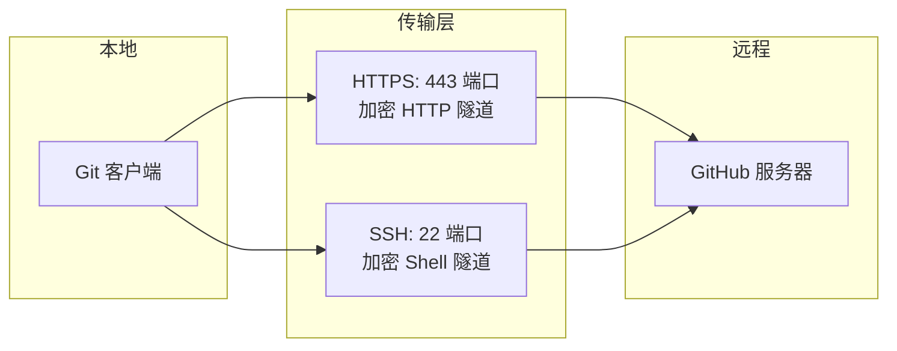
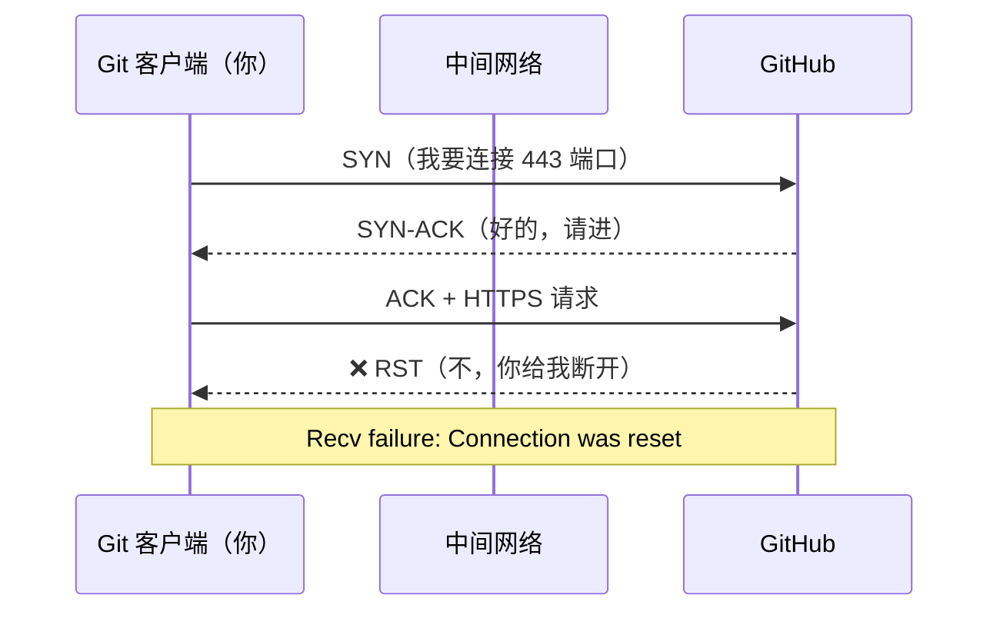
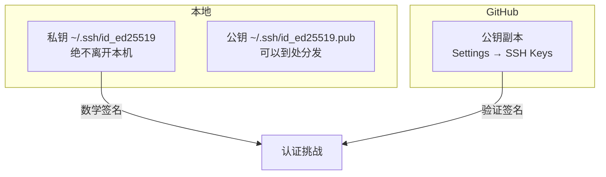
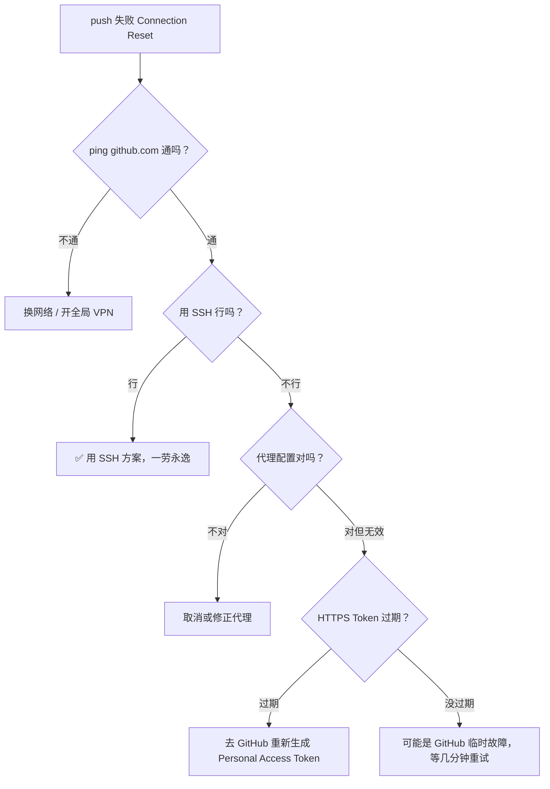

## 问题现象

```bash
git push origin main

# 报错：
fatal: unable to access 'https://github.com/...':
Recv failure: Connection was reset
```

这个错误的意思是：Git 尝试通过 HTTPS 连接到 GitHub，但在传输过程中**连接被对方或中间网络强制断开**。这篇文章会解释每种解决方案为什么能够生效、背后的网络原理是什么。

---

## 一、先理解：Git 是怎么和 GitHub 通信的



Git 支持两种协议和 GitHub 通信：

| 协议 | 端口 | 认证方式 | URL 格式 |
|------|------|---------|----------|
| **HTTPS** | 443 | 用户名 + Token / 密码 | `https://github.com/user/repo.git` |
| **SSH** | 22 | 公钥/私钥对 | `git@github.com:user/repo.git` |

当前你的仓库用的是 HTTPS（报错信息里能看出来）。问题就出在这条 HTTPS 通道上。

---

## 二、为什么 HTTPS 会 Connection Reset

### 2.1 什么是 Connection Reset

TCP 连接建立后，一方突然发送 RST（Reset）包强行断开连接。本质上就是：**"我不跟你玩了"**。



### 2.2 四大元凶

```
可能性排序：
  🔴 代理干扰    ████████████  65%
  🟡 认证过期    ██████        25%
  🟢 防火墙阻断  ██             7%
  🔵 GitHub 故障 █              3%
```

#### 元凶 1：代理服务器作祟（最常见）

很多国内开发者的 Git 代理配置指向了某个本地代理软件（Clash、V2Ray 等）。结构如下：

```
Git → 本地代理（127.0.0.1:7890）→ 远程代理服务器 → GitHub
```

任何一环出问题（代理软件没启动、端口变了、服务器挂了），连接就断。而且 Git 的代理是**单独配置**的，浏览器能上网不代表 Git 也能。

#### 元凶 2：GitHub Token 过期

2021 年起，GitHub 禁止了密码认证。HTTPS 推送必须用 **Personal Access Token**。Token 过期后，GitHub 会直接拒绝连接——表现形式同样是 connection reset。

#### 元凶 3：企业防火墙 / ISP 拦截

`github.com:443` 在某些网络环境下会被 QoS 限制或直接阻断。SSH 的 22 端口反而有可能放行。

---

## 三、方案一：HTTPS 换 SSH — 为什么有效

### 3.1 SSH 的认证模型



**核心原理：非对称加密**

1. 你生成一对密钥：公钥（可以公开）+ 私钥（绝对保密）
2. 把公钥上传到 GitHub
3. 连接时，GitHub 用你的公钥加密一个随机字符串发给你
4. 你的本机用私钥解密并返回，证明"我就是密钥的主人"
5. 全程私钥不离开本机，安全性极高

### 3.2 为什么 SSH 比 HTTPS 更稳

| | HTTPS | SSH |
|------|-------|-----|
| **端口** | 443 | 22 |
| **代理干扰** | 容易被 HTTP 代理拦截 | 不走 HTTP 代理 |
| **认证机制** | Token（有过期风险） | 密钥对（永不过期） |
| **网络要求** | 依赖 TLS 握手稳定性 | TCP 层更底层，干扰少 |
| **防火墙友好度** | 443 通常开放 | 22 可能被封 |

SSH 不走 HTTP 代理，直接绕过了最常见的代理配置问题。而且密钥认证无需每次都传 Token，简洁可靠。

### 3.3 操作拆解

**第一步：生成密钥对**

```bash
ssh-keygen -t ed25519 -C "your_email@example.com"
```

| 参数 | 含义 |
|------|------|
| `-t ed25519` | 使用 Ed25519 算法（比 RSA 更快更安全） |
| `-C "..."` | 添加注释（方便在 GitHub 上识别是哪台机器） |

生成的文件：
- `~/.ssh/id_ed25519` — 私钥，权限必须是 `600`（只有你能读）
- `~/.ssh/id_ed25519.pub` — 公钥，可以安全分享

**第二步：上传公钥**

```bash
cat ~/.ssh/id_ed25519.pub
```

输出的内容类似：`ssh-ed25519 AAAAC3NzaC... your_email@example.com`

复制整行，粘贴到 GitHub → Settings → SSH and GPG keys → New SSH Key。

**第三步：切换远程地址**

```bash
git remote set-url origin git@github.com:tsinghong1984/tsinghong1984.git
```

`git@github.com` 是 GitHub 的 SSH 用户，不是你自己的用户名。所有 GitHub SSH 连接都用这个固定用户名。

---

## 四、方案二：调整 HTTPS 代理 — 代理的工作原理

### 4.1 Git 的代理配置是独立的

```bash
# 查看当前代理
git config --global --get http.proxy
git config --global --get https.proxy
```

Git 的代理**不会自动使用系统代理**，而是需要显式配置：`git config --global http.proxy <代理地址>`。

这就产生了一个经典问题：

> 你的浏览器通过系统代理能访问 GitHub，但 Git 不知道代理在哪。

### 4.2 代理地址的含义

```
http://127.0.0.1:7890
      │          │
      │          └─ 端口号（不同代理软件不同）
      └─ 本机回环地址（代理软件在你本机运行）
```

| 代理软件 | 默认端口 |
|----------|---------|
| Clash / Clash Verge | 7890 |
| V2Ray / V2RayN | 10809 |
| Shadowsocks | 1080 |
| 小飞机 | 1080 |

### 4.3 为什么取消代理有时就能好

```bash
git config --global --unset http.proxy
git config --global --unset https.proxy
```

三种常见场景：

1. **代理软件没开** → Git 还在往 7890 端口发请求 → 无人响应 → 连接超时/重置
2. **网络环境变了** → 在家不需要代理，但 Git 配置还指向公司代理 → 连不上
3. **直接能连 GitHub** → 某些网络下 GitHub 没被墙，不需要代理，取消反而更快

**本质**：取消代理让 Git 走默认的直接 TCP 连接，不走代理中间人。

---

## 五、为什么 `ping github.com` 能诊断网络层问题

```bash
ping github.com
```

`ping` 用的是 **ICMP 协议**，运行在比 HTTP/SSH 更底层的位置：

```
应用层   HTTP / SSH        ─ 你的请求数据
传输层   TCP                ─ 端口号、连接管理
网络层   IP / ICMP (ping)   ─ 数据包的路由
链路层   以太网              ─ 物理传输
```

如果 `ping github.com` 不通：
- 说明**网络层**就断了——不是 Git 配置的问题，是根本连不上 GitHub 的 IP
- 解决方案：换网络（连手机热点）、开全局 VPN

如果 `ping github.com` 通但 push 失败：
- 说明 IP 层没问题，是**更上层的协议/端口**被阻拦
- 测试 SSH 端口连通性：`ssh -T git@github.com`
- 测试 HTTPS 端口连通性：`curl -v https://github.com`

---

## 六、排除优先级总结



**最优路径**：SSH 方案通常是最终答案。它绕过了 HTTP 代理的复杂性，使用更底层的 TCP 直连，且认证永久有效。

---

## 延伸：SSH 的 `~/.ssh/config` 优化

如果经常用 GitHub，可以在 `~/.ssh/config` 中添加：

```
Host github.com
    HostName github.com
    User git
    IdentityFile ~/.ssh/id_ed25519
    # 国内网络下可以加这个保持连接
    ServerAliveInterval 60
```

`ServerAliveInterval 60` 让 SSH 每 60 秒发一个心跳包，防止长时间闲置时被中间路由设备断开。
