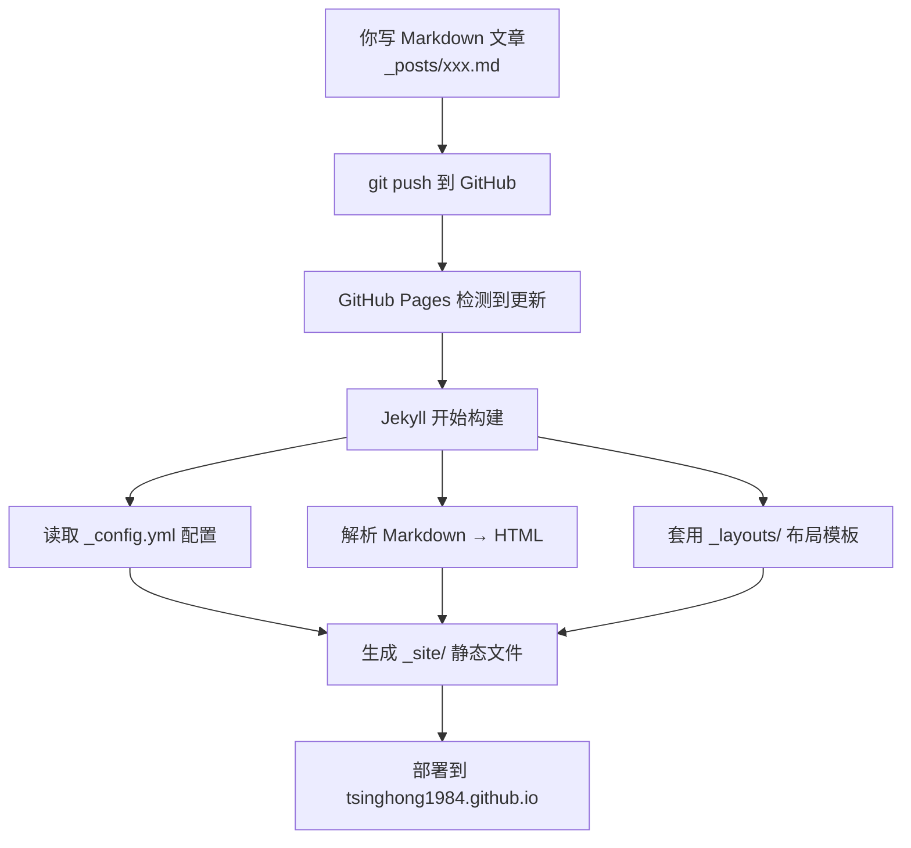

## 前言

这篇文章会详细拆解刚才搭建的 Jekyll 博客系统的**每一层原理**——每个文件是干什么的、为什么这样设计、GitHub Pages 在背后做了什么。读完你会彻底搞懂这套系统，以后自己随便改。

---

## 一、整体架构：谁在干活？



**核心概念**：Jekyll 是一个**静态网站生成器**。你在本地只需要写 Markdown，它负责把 Markdown + 布局模板 → 拼成完整的 HTML 页面。GitHub Pages 在每次 `push` 后自动运行 Jekyll，全程无需手动操作。

---

## 二、逐文件拆解

### 2.1 `_config.yml` — 全局配置文件

```yaml
title: Wu-uY · Personal Site          # 网站标题
description: 兀虞的个人空间            # SEO 描述
baseurl: ""                            # 子路径（根域名不留空）
url: "https://tsinghong1984.github.io" # 完整域名
markdown: kramdown                     # Markdown 解析引擎
permalink: /notes/:year/:month/:day/:title/  # 文章 URL 格式
```

**关键参数详解：**

**`baseurl`**：如果你的站点在 `yourname.github.io/myproject/` 下，这里要填 `/myproject`。我们的仓库是 `tsinghong1984.github.io`（用户主页仓库），所以留空。

**`permalink`**：决定了每篇文章的 URL 长什么样。

| 变量 | 含义 | 示例值 |
|------|------|--------|
| `:year` | 文章年份 | 2026 |
| `:month` | 文章月份 | 06 |
| `:day` | 文章日期 | 15 |
| `:title` | 文章标题（从文件名提取） | hello-world |

所以 `2026-06-15-hello-world.md` → `/notes/2026/06/15/hello-world/`。

之所以用层级式而非扁平式（如 `/notes/hello-world/`），好处是：
- URL 自带时间信息，直观
- 方便以后按年份归档
- SEO 友好

---

### 2.2 `_layouts/default.html` — 所有页面的"骨架"

这是最核心的文件，定义了**除了首页之外所有页面的结构**。它做了三件事：

#### （1）CSS 变量体系

```css
:root {
    --bg: #0a0e14;        /* 深色背景 */
    --accent: #39bae6;    /* 主题色（青蓝） */
    --border: #1e2a36;    /* 边框色 */
    --font-mono: ...;     /* 等宽字体栈 */
    --font-sans: ...;     /* 无衬线字体栈 */
}
```

所有颜色、字体都用 CSS 变量，改一个地方全局生效。这是"设计系统"的思想。

#### （2）背景特效层

```html
<div class="bg-grid"></div>   <!-- 网格背景 -->
<div class="orb orb-1"></div> <!-- 浮动光球 1 -->
<div class="orb orb-2"></div> <!-- 浮动光球 2 -->
```

这三个 div 固定在 `position: fixed`，`z-index: 0`，保证在所有内容下方。网格用了 `mask-image: radial-gradient` 做渐变淡出，视觉上只在中上区域可见。

#### （3）`content` 占位符

`default.html` 的核心机制是一个叫 `content` 的 Liquid 占位符变量。在模板的 `<div class="container">` 内部，它写入 `{{ "{{ content }}" }}`，Jekyll 渲染时会把子页面的内容注入到这个位置。

这是 **Liquid 模板引擎**的语法。当子页面通过 front matter 声明 `layout: default` 时，Jekyll 会把子页面的全部内容填入 `content` 变量所在的位置，拼出完整 HTML。

**为什么首页不用这个布局？** 因为首页有自己的 CSS（完全写在 `<style>` 里），用 `--- ---` 加空 front matter 让 Jekyll 识别但不套布局。

---

### 2.3 `_layouts/post.html` — 文章页布局

`post.html` 继承 `default.html`（通过 front matter 声明 `layout: default`）。它负责文章页特有的结构：

- **返回按钮**：一个指向 `/blog/` 的 `← 返回笔记` 链接
- **文章标题**：通过 `page.title` 变量从文章 front matter 中获取
- **发布日期**：通过 `page.date` 变量获取，按 `YYYY-MM-DD` 格式显示
- **正文区域**：通过 `content` 占位符注入渲染后的文章正文

**布局继承链**：

```
Markdown 文章（_posts/xxx.md）
    │
    ├── front matter: layout: post
    │
    ▼
_layouts/post.html
    │
    ├── front matter: layout: default  
    │   （渲染后的文章内容作为 content 传给 default）
    ▼
_layouts/default.html
    │
    ▼
最终 HTML 输出
```

**Jekyll 的 `page` 对象**：在布局中可以通过 `page.xxx` 访问文章 front matter 中定义的任何变量。比如这篇文件的 front matter 声明了 `title` 和 `date`，所以 `page.title` 获取标题，`page.date` 获取日期。

---

### 2.4 `blog/index.html` — 文章列表页

这个页面不需要维护，它用 Liquid 循环自动列出所有文章。核心逻辑是遍历 Jekyll 内置的 `site.posts` 数组（包含 `_posts/` 下所有文章，按日期倒序排列）。

对每篇文章可访问以下属性：

| 属性 | 含义 |
|------|------|
| `post.url` | 文章 URL（由 `_config.yml` 的 permalink 自动生成） |
| `post.title` | 文章标题 |
| `post.date` | 文章日期 |
| `post.excerpt` | 文章摘要（第一段或 `<!--more-->` 之前的内容） |

列表外观复用了首页的 `.link-item` 样式——图标 + 标题 + 描述 + 箭头，保持视觉一致性。你添加新文章后刷新博客列表页，文章会自动出现在列表中，无需手动编辑。

---

### 2.5 `_posts/YYYY-MM-DD-标题.md` — 文章本体

文件名格式 `YYYY-MM-DD-标题.md` 是 Jekyll 的**强制规范**：
- 前面的日期决定了文章的时间顺序
- `-` 之后的部分被提取为 URL slug

front matter 中的 `layout: post` 告诉 Jekyll "用 `_layouts/post.html` 渲染我"。

---

## 三、GitHub Pages 的后台流程

```
你 push 代码
    ↓
GitHub 收到 webhook
    ↓
启动 GitHub Actions Runner（或旧版 Jekyll Builder）
    ↓
执行: jekyll build --source . --destination _site
    ↓
_site/ 目录就是最终的静态网站
    ↓
部署到 tsinghong1984.github.io 的 Web 服务器
```

关键点：
- **不需要本地安装 Jekyll**，一切在 GitHub 服务器上完成
- `_site/` 是构建产物，不需要提交到 Git（`.gitignore` 自动忽略）
- 下划线开头的目录（`_layouts/`、`_posts/`）是 Jekyll 的特殊目录，不会直接暴露为 URL

---

## 四、修改指南

### 改主题色

编辑 `_layouts/default.html` 的 `:root`：

```css
--accent: #ff6b6b;       /* 换成红色 */
--accent-glow: #ff6b6b66;
```

### 改文章 URL 格式

编辑 `_config.yml` 的 `permalink`：

```yaml
# 扁平式
permalink: /notes/:title/

# 分类式
permalink: /:categories/:year/:month/:title/
```

### 添加新页面

在根目录创建 `about.md`：

```markdown
---
layout: default
title: 关于我
---
内容...
```

访问 `https://tsinghong1984.github.io/about/`（不加 `.md` 后缀）。

---

## 五、一个重要的坑：Liquid 转义

在 Jekyll 的 Markdown 文章里写教程时，如果要展示 `{{ }}` 这类 Liquid 语法，必须用 `raw` 标签包裹。但 `raw` 标签本身也是 Liquid 语法，如果嵌套不当很容易导致构建失败。

**最佳实践**：
- 纯 HTML/CSS/YAML 代码块可以直接放，Jekyll 不解析
- 包含 `{{ }}` 或 `` 的代码示例，要么用文字描述替代，要么在最外层严格包裹 `raw` 标签
- GitHub Pages 的 Jekyll 版本较旧（3.10），对有些语法支持有限，出问题时优先用文字描述

---

## 总结

| 文件 | 角色 | 类比 |
|------|------|------|
| `_config.yml` | 全局设置 | 系统偏好设置 |
| `_layouts/default.html` | 页面骨架 | 房屋框架 |
| `_layouts/post.html` | 文章模板 | 房间装修 |
| `_posts/*.md` | 文章内容 | 家具摆设 |
| `blog/index.html` | 文章目录 | 楼层索引 |

搞懂这五个角色，整个系统就尽在掌握。
