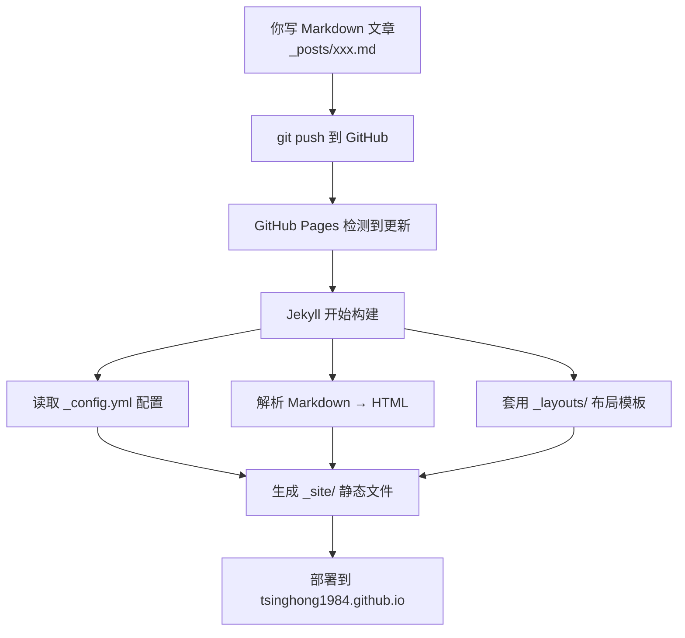

## 前言

这篇文章会详细拆解刚才搭建的 Jekyll 博客系统的**每一层原理**——每个文件是干什么的、为什么这样设计、GitHub Pages 在背后做了什么。读完你会彻底搞懂这套系统，以后自己随便改。

---

## 一、整体架构：谁在干活？



**核心概念**：Jekyll 是一个**静态网站生成器**。你在本地只需要写 Markdown，它负责把 Markdown + 布局模板 → 拼成完整的 HTML 页面。GitHub Pages 在每次 `push` 后自动运行 Jekyll，全程无需手动操作。

---

## 二、逐文件拆解

### 2.1 `_config.yml` — 全局配置文件

```yaml
title: Wu-uY · Personal Site          # 网站标题
description: 兀虞的个人空间            # SEO 描述
baseurl: ""                            # 子路径（根域名不留空）
url: "https://tsinghong1984.github.io" # 完整域名
markdown: kramdown                     # Markdown 解析引擎
permalink: /notes/:year/:month/:day/:title/  # 文章 URL 格式
```

**关键参数详解：**

**`baseurl`**：如果你的站点在 `yourname.github.io/myproject/` 下，这里要填 `/myproject`。我们的仓库是 `tsinghong1984.github.io`（用户主页仓库），所以留空。

**`permalink`**：决定了每篇文章的 URL 长什么样。

| 变量 | 含义 | 示例值 |
|------|------|--------|
| `:year` | 文章年份 | 2026 |
| `:month` | 文章月份 | 06 |
| `:day` | 文章日期 | 15 |
| `:title` | 文章标题（从文件名提取） | hello-world |

所以 `2026-06-15-hello-world.md` → `/notes/2026/06/15/hello-world/`。

之所以用层级式而非扁平式（如 `/notes/hello-world/`），好处是：
- URL 自带时间信息，直观
- 方便以后按年份归档
- SEO 友好

---

### 2.2 `_layouts/default.html` — 所有页面的"骨架"

这是最核心的文件，定义了**除了首页之外所有页面的结构**。它做了三件事：

#### （1）CSS 变量体系

```css
:root {
    --bg: #0a0e14;        /* 深色背景 */
    --accent: #39bae6;    /* 主题色（青蓝） */
    --border: #1e2a36;    /* 边框色 */
    --font-mono: ...;     /* 等宽字体栈 */
    --font-sans: ...;     /* 无衬线字体栈 */
}
```

所有颜色、字体都用 CSS 变量，改一个地方全局生效。这是"设计系统"的思想。

#### （2）背景特效层

```html
<div class="bg-grid"></div>   <!-- 网格背景 -->
<div class="orb orb-1"></div> <!-- 浮动光球 1 -->
<div class="orb orb-2"></div> <!-- 浮动光球 2 -->
```

这三个 div 固定在 `position: fixed`，`z-index: 0`，保证在所有内容下方。网格用了 `mask-image: radial-gradient` 做渐变淡出，视觉上只在中上区域可见。

#### （3）`{{ content }}` 占位符

```html
<div class="container">
    {{ content }}   ← 子页面的内容注入到这里
    <footer>...</footer>
</div>
```

这是 Jekyll 的 **Liquid 模板引擎**语法。当你写：

```yaml
---
layout: default
---
<h1>我的内容</h1>
```

Jekyll 会先把 `<h1>我的内容</h1>` 填入 `{{ content }}`，再输出完整 HTML。

**为什么首页不用这个布局？** 因为首页有自己的 CSS（完全写在 `<style>` 里），用 `--- ---` 加空 front matter 让 Jekyll 识别但不套布局。

---

### 2.3 `_layouts/post.html` — 文章页布局

```yaml
---
layout: default    ← 继承 default.html 的骨架
---
<header>
    <a href="/blog/" class="back-link">← 返回笔记</a>
    <div class="blog-header">
        <h1>{<!-- raw -->{ page.title }}</h1>    ← 从文章 front matter 获取标题
        <p>{<!-- raw -->{ page.date }}</p>        ← 从文章 front matter 获取日期
    </div>
</header>
<div class="divider"></div>
<article class="post-content">
    {<!-- raw -->{ content }}   ← 文章的 Markdown 正文渲染后注入
</article>
```

**布局继承链**：

```
Markdown 文章（_posts/xxx.md）
    │
    ├── front matter: layout: post
    │
    ▼
_layouts/post.html
    │
    ├── front matter: layout: default  
    │   （渲染后的文章内容作为 content 传给 default）
    ▼
_layouts/default.html
    │
    ▼
最终 HTML 输出
```

**Jekyll 的 `page` 对象**：在布局中可以通过 `{<!-- raw -->{ page.xxx }}` 访问文章 front matter 中定义的任何变量。这篇文件的 front matter 是：

```yaml
---
layout: post
title: "深入理解 Jekyll + GitHub Pages 博客的配置原理"
date: 2026-06-15
---
```

所以 `page.title` 就是标题，`page.date` 就是日期。

---

### 2.4 `blog/index.html` — 文章列表页

```liquid


<a href="{{ post.url }}" class="link-item">
    <div class="link-title">{{ post.title }}</div>
    <div class="link-desc">{{ post.date }} · {{ post.excerpt }}</div>
</a>


```

**`{%% raw %%}site.posts{%% endraw %%}`**：这是 Jekyll 内置的全局变量，包含 `_posts/` 下所有文章，按日期倒序排列。对每篇文章你可访问：

| 属性 | 含义 |
|------|------|
| `post.url` | 文章 URL（由 `_config.yml` 的 permalink 决定） |
| `post.title` | 文章标题 |
| `post.date` | 文章日期 |
| `post.excerpt` | 文章摘要（第一段或 `<!--more-->` 之前的内容） |

所以这个页面本质就是一个 **Liquid 循环**，自动遍历所有 `.md` 文件生成链接列表。你不需要手动维护列表。

---

### 2.5 `_posts/YYYY-MM-DD-标题.md` — 文章本体

文件名格式 `YYYY-MM-DD-标题.md` 是 Jekyll 的**强制规范**：
- 前面的日期决定了文章的时间顺序
- `-` 之后的部分被提取为 URL slug

front matter 中的 `layout: post` 告诉 Jekyll "用 `_layouts/post.html` 渲染我"。

---

## 三、GitHub Pages 的后台流程

```
你 push 代码
    ↓
GitHub 收到 webhook
    ↓
启动 GitHub Actions Runner（或旧版 Jekyll Builder）
    ↓
执行: jekyll build --source . --destination _site
    ↓
_site/ 目录就是最终的静态网站
    ↓
部署到 tsinghong1984.github.io 的 Web 服务器
```

关键点：
- **不需要本地安装 Jekyll**，一切在 GitHub 服务器上完成
- `_site/` 是构建产物，不需要提交到 Git（`.gitignore` 自动忽略）
- 下划线开头的目录（`_layouts/`、`_posts/`）是 Jekyll 的特殊目录，不会直接暴露为 URL

---

## 四、修改指南

### 改主题色

编辑 `_layouts/default.html` 的 `:root`：

```css
--accent: #ff6b6b;       /* 换成红色 */
--accent-glow: #ff6b6b66;
```

### 改文章 URL 格式

编辑 `_config.yml` 的 `permalink`：

```yaml
# 扁平式
permalink: /notes/:title/

# 分类式
permalink: /:categories/:year/:month/:title/
```

### 添加新页面

在根目录创建 `about.md`：

```markdown
---
layout: default
title: 关于我
---
内容...
```

访问 `https://tsinghong1984.github.io/about/`（不加 `.md` 后缀）。

---

## 总结

| 文件 | 角色 | 类比 |
|------|------|------|
| `_config.yml` | 全局设置 | 系统偏好设置 |
| `_layouts/default.html` | 页面骨架 | 房屋框架 |
| `_layouts/post.html` | 文章模板 | 房间装修 |
| `_posts/*.md` | 文章内容 | 家具摆设 |
| `blog/index.html` | 文章目录 | 楼层索引 |

搞懂这五个角色，整个系统就尽在掌握。
