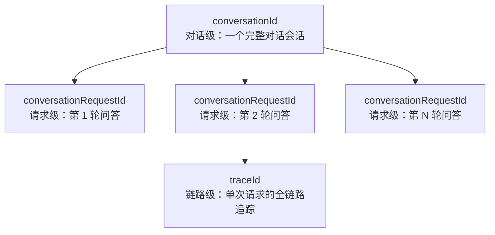
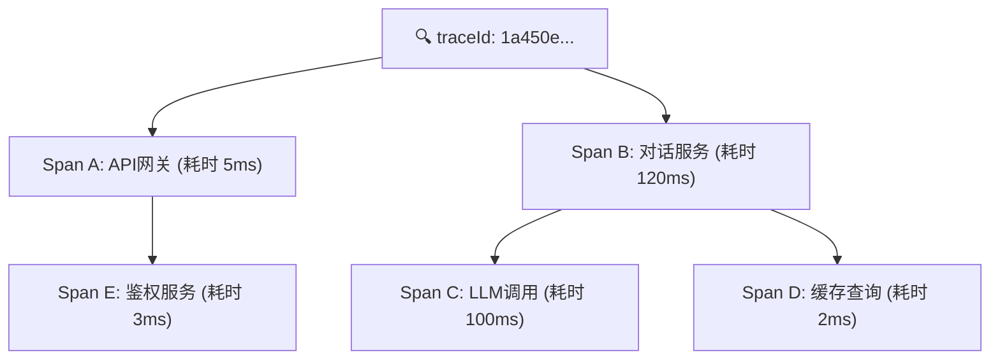
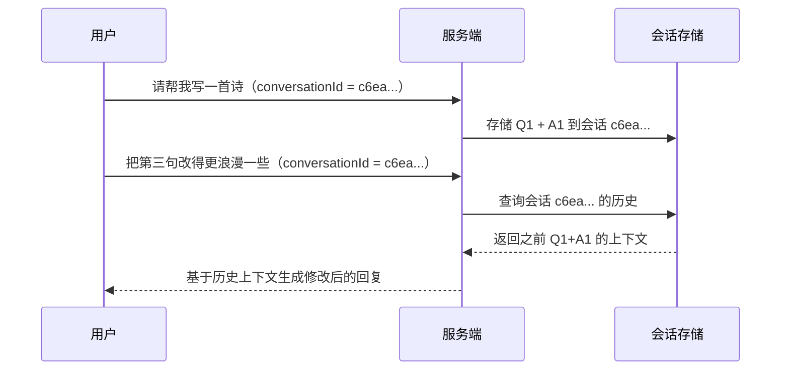

## 原始数据

```json
{
  "traceId": "1a450e3385e67cf8bae6104a96cb5f53",
  "conversationRequestId": "5974b950bed545a8b3bbf63ee09e1d7e",
  "conversationId": "c6ea941b7beb4d539d39b2cb8b421da4"
}
```

这看起来很短，但三个 ID 之间构成了一套完整的**层级追踪体系**。我们来逐层拆解。

---

## 一、三个 ID 的层级关系



| 层级 | ID | 生命周期 | 类比 |
|------|-----|----------|------|
| **会话** | `conversationId` | 从用户打开对话到关闭 | 一次完整的聊天 |
| **请求** | `conversationRequestId` | 从用户发消息到收到回复 | 对话中的一轮问答 |
| **链路** | `traceId` | 从请求进入 → 跨服务调用 → 响应返回 | 一次请求的内部旅程 |

---

## 二、traceId：分布式追踪的核心

### 2.1 它是什么

`traceId` 是 **OpenTelemetry / Jaeger / Zipkin** 等分布式追踪系统的标准概念。一个 trace 代表**一次完整的请求在微服务系统中的全部旅程**。

以 AI 对话场景为例，一次请求可能穿过：

```
用户 → API网关 → 对话管理服务 → LLM推理服务 → 向量数据库
                                              → 缓存服务
                                              → 流式响应
```

这条链路上的所有调用共享**同一个 traceId**。

### 2.2 为什么有效：Trace 树

每一跳产生一个 **span**，所有 span 挂在同一个 traceId 下：



**关键设计**：span 之间有父子关系。比如 LLM 调用慢，你看 Span C 就知道了，不需要在几百条日志里大海捞针。

### 2.3 为什么用 32 位十六进制

```
1a450e3385e67cf8bae6104a96cb5f53
```

- **128-bit**，分两段（高 64 位 + 低 64 位），每段 16 个十六进制字符
- 高 64 位通常是时间戳 + 随机数，低 64 位是纯随机
- 生成算法保证了**全局唯一性**和**时间有序性**（方便排序）

这个设计的精妙之处：

```
1a450e33  85e67cf8  bae6104a  96cb5f53
│         │         │         │
│         │         │         └─ 纯随机（防碰撞）
│         │         └─ 纯随机
│         └─ 毫秒级时间戳高位
└─ 毫秒级时间戳低位
```

**为什么不用自增 ID？** 因为分布式系统中没有全局计数器。即使两个不同机器在同一毫秒生成 traceId，低位的随机数也保证了两者不会碰撞（碰撞概率 ≈ 10⁻¹⁹）。

---

## 三、conversationRequestId：请求级标识

```
5974b950bed545a8b3bbf63ee09e1d7e
```

### 3.1 和 traceId 的区别

| | traceId | conversationRequestId |
|------|---------|----------------------|
| **作用域** | 技术层面（跨服务调用链） | 业务层面（一次用户请求） |
| **定义者** | OpenTelemetry 标准 | 业务系统自定义 |
| **粒度** | 一组 span 的集合 | 一个 request-response 循环 |
| **典型用途** | 排查性能瓶颈、错误定位 | 幂等性保证、重复请求去重 |

### 3.2 为什么需要两个 ID

**场景：一次对话请求内部有 3 次 LLM 调用的重试。**

```
conversationRequestId: 5974b9...  (不变——用户只发起了一次请求)
    ├── traceId_1: abc...  (第 1 次尝试 → 超时)
    ├── traceId_2: def...  (第 2 次尝试 → 超时)
    └── traceId_3: ghi...  (第 3 次尝试 → 成功)
```

`conversationRequestId` 把三次尝试**从业务上串在一起**，`traceId` 从技术上区分每一次底层调用。两层 ID 编织成了排查问题的双坐标系。

### 3.3 幂等性的实现机制

这个 ID 的另一大用途是**幂等键**。同一个 `conversationRequestId` 的重复请求，服务端只执行一次：

```
客户端发送请求（含 conversationRequestId）
    ↓
服务端：Redis GET 5974b950...
    ├── 不存在 → 执行业务逻辑，写入缓存
    └── 已存在 → 直接返回缓存结果
```

这在支付、下单等场景至关重要，防止网络重试导致的重复操作。

---

## 四、conversationId：会话级标识

```
c6ea941b7beb4d539d39b2cb8b421da4
```

### 4.1 它管什么

这个 ID 的生命周期最长——**从用户建立对话到对话结束（或过期）**。

### 4.2 携带会话上下文

在多轮对话中，每次请求需要知道"之前说过什么"：



**为什么不用 conversationRequestId 代替？** 因为后者每次请求都会变，没法跨轮次关联。conversationId 保持不变，像一根线把所有问答串起来。

### 4.3 能力边界

| 能做什么 | 不能做什么 |
|---------|-----------|
| 关联同一对话的所有请求 | 跨对话关联 |
| 按用户维度查询对话历史 | 用户身份识别（需配合 token） |
| 设置对话过期时间和长度限制 | 替代 auth 鉴权 |

---

## 五、三者协作：一个完整的排查案例

假设你收到了用户投诉："刚才的回复卡住了没出来"。

### 排查步骤

```
第 1 步：拿到 conversationId = c6ea941b...
    → 查询日志，定位到该用户的具体对话

第 2 步：找到最近一条 conversationRequestId = 5974b950...
    → 锁定是"哪一轮"出了问题

第 3 步：提取 traceId = 1a450e33...
    → 打开 Trace 平台（Jaeger / Grafana），全景图展开：

    API 网关     ████░░░░░░  (4ms)    ✅
    对话服务     ██████████  (10ms)   ✅
    LLM 推理     ████████████████████░░░░ (超时!) ❌
    缓存         ██░░░░░░░░  (2ms)    ✅

    → 定位到 LLM 推理超时，排查下游 GPU 集群状态
```

没有这套 ID 体系，你需要靠时间戳、关键词去 grep 日志——慢且容易漏。

---

## 六、设计精要总结

这三个 ID 的设计遵循了**分布式追踪的三层模型**：

| 层级 | ID | 核心价值 |
|------|-----|---------|
| **Session** | `conversationId` | 用户体验维度的完整性——"这次对话发生了什么" |
| **Request** | `conversationRequestId` | 业务维度的可追溯性——"这个请求是否成功、如何幂等" |
| **Trace** | `traceId` | 技术维度的可观测性——"这次请求在系统内部走了哪些路" |

三条线各司其职又能交叉索引，构成了排查问题的**三维坐标系**。这也是为什么大型分布式系统（微信、淘宝、AWS）无一例外都采用类似的分层 ID 设计——它不是凭空创造的规范，而是从无数生产事故中提炼出来的**生存法则**。
